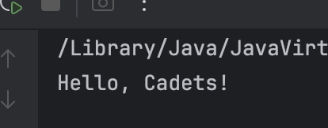
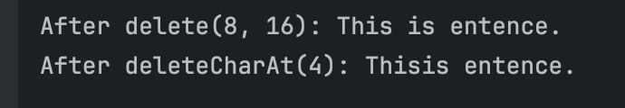
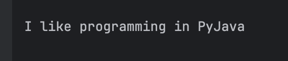
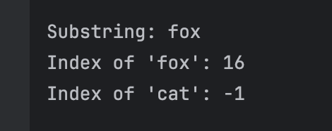
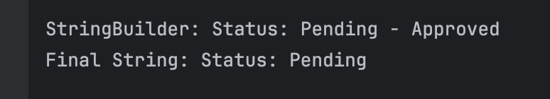

# Exploring Java `StringBuilder`

**Name:** Andre Dominic Ha Lacra

---

## Output Screenshots and Explanations per Exercise

---

### Exercise 1: `append()` - Appending Content

**Prediction**  
In StringBuilder, when we use `.append()`, it act same as concatenating of Strings. So the prediction of the output based on below code will be `Hello, Cadets!`.

**Observation**  
```
Hello, Cadets!
```

**Output Screenshot:**  


---

### Exercise 2: `insert()` - Inserting Content at a Position

**Prediction**  
In StringBuilder, when we use `.insert()`, it acts same as `append()`, but it provides more `flexibility` by inserting a String based on the `index/offset` that we want to insert in our StringBuilder. So the output will be `Java is really great!`

**Observation**  
```
Java is really great!
```

**Output Screenshot:**  


---

### Exercise 3: `delete()` - Deleting Content

**Prediction**  
With `delete()`, we will specify the starting of index that we want to delete, in this case it will be index `8`, it will start deleting at character `'a'`, since it is `inclusive`. The next/end index is `16`, so at index `16`, it will delete `"a test s"`, take note that end index in `delete()` is `exclusive`, so technically it will delete the last index at `15` which is `'s'`. Output here will be `"This is entence."` And for `deleteCharAt()`, we only need to specify the index that we want to delete, since StringBuilder is `mutable`, this makes `deleteCharAt(4)` delete the character `" "` at our current `"This is entence."` for String Builder.

**Observation**  
```
After delete(8, 16): This is entence.
After deleteCharAt(4): Thisis entence.
```

**Output Screenshot:**  


---

### Exercise 4: `replace()` - Replacing a Section

**Prediction**  
With `replace()`, it creates a StringBuilder with the text `"I like programming in Python."` Then it replaces the characters from index `24` to `30` with `"Java"`.

**Observation**  
```
I like programming in PyJava
```

**Output Screenshot:**  


---

### Exercise 5: Method Chaining

**Prediction**  
With the declared StringBuilder `"Start"`, next we appends `"..."` to make it `"Start..."`. Then, it inserts `"Ready, Set, "` at the beginning, resulting in `"Ready, Set, Start..."`. Finally, it deletes the characters from index `12` to `15` (which corresponds to `"Sta"`), leaving the final output as `"Ready, Set, rt..."`.

**Observation**  
```
Ready, Set, rt...
```

**Output Screenshot:**  


---

### Exercise 6: `substring()`, `indexOf()`, and Non-Existing Words

**Prediction**  
We extract a substring from index `16` to `19` of `sb6` (String Builder), which gives `"fox"`. Then, it finds the index of the word `"fox"` in the string, which is at index `16`. Lastly, it searches for the word `"cat"`, which doesn't exist in the string, so it returns `-1`.

**Observation**  
```
Substring: fox
Index of 'fox': 16
Index of 'cat': -1
```

**Output Screenshot:**  


---

### Exercise 7: `toString()` - Converting back to a String

**Prediction**  
We declare a StringBuilder with the text `"Status: "` and appends `"Pending"`, making it `"Status: Pending"`. It then stores the current content as a separate String in `finalStatus`. After that, `" - Approved"` is appended to the StringBuilder, making it `"Status: Pending - Approved"`. However, `finalStatus` remains unchanged as `"Status: Pending"` because it's a snapshot taken before the second append. The output shows `"Status: Pending - Approved"` and `"Status: Pending"`.

**Observation**  
```
StringBuilder: Status: Pending - Approved
Final String: Status: Pending
```

**Output Screenshot:**  


---


